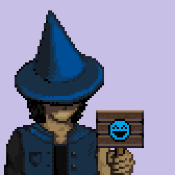

Hi, today I have to honor of presenting the Player character of our currently in development game
Endless Dungeon.

***

Finally the day of my graduation from the wizard school of Remingdell had come, the day I had been 
waiting for so long! Today I was going to receive my wizard degree and from there on I was free to 
explore the wonders of the world and become a great mage. Excitement filled my chest, when thinking 
of the future.

But for this dream to become true, I had one last mission to complete. Getting the signature of the archmage Xidius Razam, headmaster of the wizard school and high wizard of the circle of Baal. 
Honestly, I was surprised to hear that I had to bring the letter of graduation to him in person, 
it seems so much easier to just send an owl...

According to what I had heard about the archmage, he was a brilliant man, but had his 
idiosyncrasies. One of which was that he wanted to meet every graduate from the wizard school 
personally, but he was usually too busy to attend the graduation ceremonies. Frankly, I had hoped 
he might show up for mine, but I hadn’t been so lucky...Therefore I had to go on this journey to his residence close to a small village called Bellwick.

A little annoyed and with a heavy heart, leaving all my friends and the small room which had become 
my home over the years, I started to pack my stuff. At least I would have my closest friend, my 
wizard animal, a cat called Krumbein, at my side.

After an emotional farewell and the promise to send an owl to my best friend Samarah, I started to 
walk north, with a clear goal in mind.

***